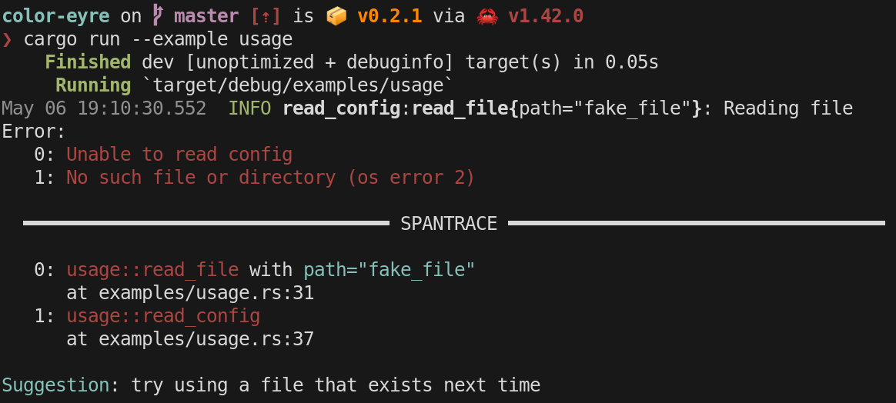
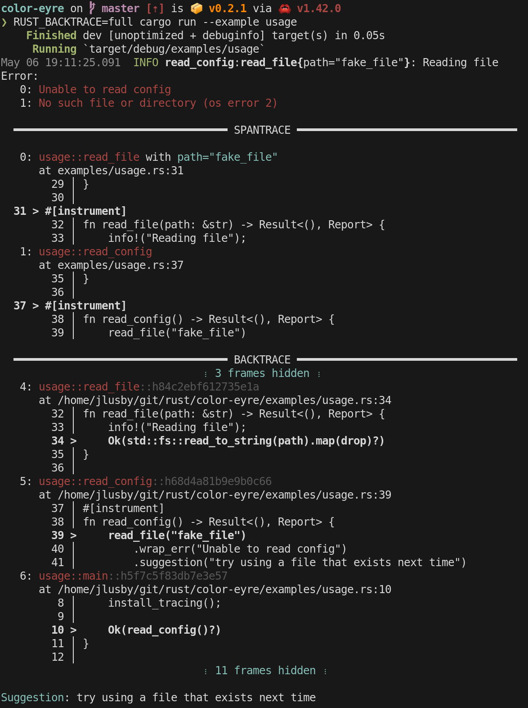

color-eyre
----------

A custom context for the [`eyre`] crate for colorful error reports, suggestions,
and [`tracing-error`] support.

**Disclaimer**: This crate is currently pre-release while I try to upstream
changes I made to [`color-backtrace`] to support this crate. Until then I
cannot publish this to crates.io, the documentation is filled out however so
simply run `cargo doc --open` for an explanation of usage.

## Explanation

This crate works by defining a `Context` type which implements [`eyre::EyreContext`]
and a pair of type aliases for setting this context type as the parameter of
[`eyre::Report`].

```rust
pub type Report = eyre::Report<Context>;
pub type Result<T, E = Report> = core::result::Result<T, E>;
```

## Features

- captures a [`backtrace::Backtrace`] and prints using [`color-backtrace`]
- captures a [`tracing_error::SpanTrace`] and prints using
[`color-spantrace`]
- Only capture SpanTrace by default for better performance.
- display source lines when `RUST_LIB_BACKTRACE=full` is set from both of
  the above libraries
- store help text via [`Help`] trait and display after final report

## Setup

Add the following to your toml file:

```toml
[dependencies]
eyre = "0.3.8"
color-eyre = "0.2.0"
```

And then import the type alias from color-eyre for [`eyre::Report`] or [`eyre::Result`].

```rust
use color_eyre::Report;

// or

fn example(&self) -> color_eyre::Result<()> {
    // ...
}
```

# Example

```rust
use color_eyre::{Help, Report};
use eyre::WrapErr;
use tracing::{info, instrument};
use tracing_error::ErrorLayer;
use tracing_subscriber::prelude::*;
use tracing_subscriber::{fmt, EnvFilter};

fn main() -> Result<(), Report> {
    let fmt_layer = fmt::layer().with_target(false);
    let filter_layer = EnvFilter::try_from_default_env()
        .or_else(|_| EnvFilter::try_new("info"))
        .unwrap();

    tracing_subscriber::registry()
        .with(filter_layer)
        .with(fmt_layer)
        .with(ErrorLayer::default())
        .init();

    Ok(read_config()?)
}

#[instrument]
fn read_file(path: &str) -> Result<(), Report> {
    info!("Reading file");
    Ok(std::fs::read_to_string(path).map(drop)?)
}

#[instrument]
fn read_config() -> Result<(), Report> {
    read_file("fake_file")
        .wrap_err("Unable to read config")
        .suggestion("try using a file that exists next time")
}
```

## Minimal Report Format



## Short Report Format (with `RUST_LIB_BACKTRACE=1`)


## Full Report Format (with `RUST_LIB_BACKTRACE=full`)



[`eyre`]: https://docs.rs/eyre
[`tracing-error`]: https://docs.rs/tracing-error
[`color-backtrace`]: https://docs.rs/color-backtrace
[`eyre::EyreContext`]: https://docs.rs/eyre/0.3.8/eyre/trait.EyreContext.html
[`backtrace::Backtrace`]: https://docs.rs/backtrace/0.3.46/backtrace/struct.Backtrace.html
[`tracing_error::SpanTrace`]: https://docs.rs/tracing-error/0.1.2/tracing_error/struct.SpanTrace.html
[`color-spantrace`]: https://github.com/yaahc/color-spantrace
[`Help`]: trait.Help.html
[`eyre::Report`]: https://docs.rs/eyre/0.3.8/eyre/struct.Report.html
[`eyre::Result`]: https://docs.rs/eyre/0.3.8/eyre/type.Result.html
